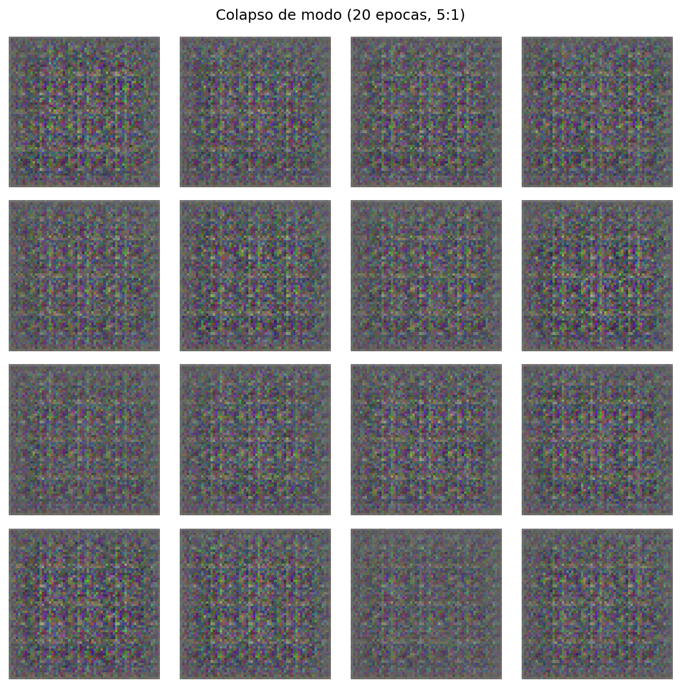
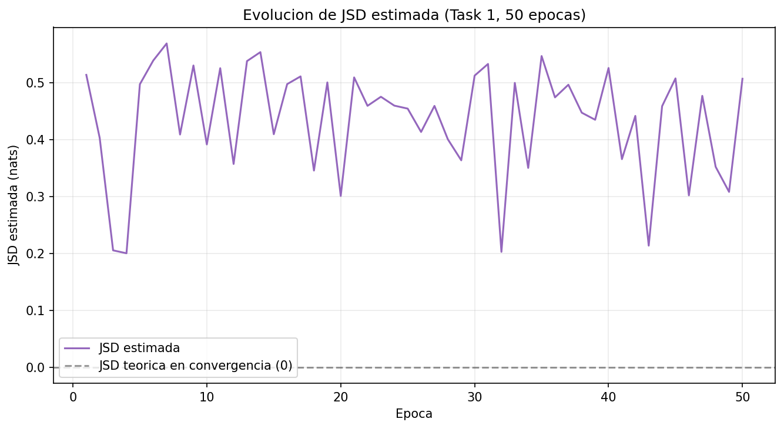

# Hoja de Trabajo 2 - DCGAN para sprites de Pokemon

**Curso:** CC3092 - Deep Learning  
**Integrantes:** Vianka Castro - Ricardo Godínez  

# Task 1 

## Task 1.1 - Generador y discriminador

### Parametros fijos

```python
Z_DIM = 100
IMG_SIZE = 64
IMG_CHANNELS = 3
FEATURES_G = 64
FEATURES_D = 64
```

### Generador

El generador recibe un vector de ruido
\(z \in \mathbb{R}^{100}\) con forma `(batch, 100, 1, 1)` y produce una imagen
con forma `(batch, 3, 64, 64)`.

| Capa | Canales | Salida espacial | Normalizacion | Activacion |
|---|---:|---:|---|---|
| ConvTranspose2d 1 | 100 -> 512 | 4x4 | BatchNorm2d | ReLU |
| ConvTranspose2d 2 | 512 -> 256 | 8x8 | BatchNorm2d | ReLU |
| ConvTranspose2d 3 | 256 -> 128 | 16x16 | BatchNorm2d | ReLU |
| ConvTranspose2d 4 | 128 -> 64 | 32x32 | BatchNorm2d | ReLU |
| ConvTranspose2d 5 | 64 -> 3 | 64x64 | Ninguna | Tanh |

La salida `Tanh` se encuentra en `[-1, 1]`, el mismo rango usado para
normalizar las imagenes reales.

### Discriminador

El discriminador recibe `(batch, 3, 64, 64)` y entrega una probabilidad por
imagen con forma `(batch,)`.

| Capa | Canales | Salida espacial | Normalizacion | Activacion |
|---|---:|---:|---|---|
| Conv2d 1 | 3 -> 64 | 32x32 | Ninguna | LeakyReLU(0.2) |
| Conv2d 2 | 64 -> 128 | 16x16 | BatchNorm2d | LeakyReLU(0.2) |
| Conv2d 3 | 128 -> 256 | 8x8 | BatchNorm2d | LeakyReLU(0.2) |
| Conv2d 4 | 256 -> 512 | 4x4 | BatchNorm2d | LeakyReLU(0.2) |
| Conv2d 5 | 512 -> 1 | 1x1 | Ninguna | Sigmoid |

La ultima salida se aplana con `.view(-1)` para obtener un escalar por imagen.

### Pruebas de forma

```python
z = torch.randn(4, Z_DIM, 1, 1)
assert generator(z).shape == (4, 3, 64, 64)

x = torch.randn(4, 3, 64, 64)
assert discriminator(x).shape == (4,)
```

**Resultado verificado:** ambas pruebas pasan. El generador tiene 3,576,704
parametros y el discriminador 2,765,568 parametros.

## Task 1.2 - Entrenamiento alternado

### Funcion de perdida y optimizadores

Se utiliza `BCELoss` y Adam para ambos modelos:

| Hiperparametro | Valor |
|---|---:|
| `batch_size` | 32 |
| `epochs` | 50 |
| `lr` | 0.0002 |
| `betas` | `(0.5, 0.999)` |
| Funcion de perdida | `BCELoss` |

Para cada batch, la perdida del discriminador es:

\[
\mathcal{L}_D =
\operatorname{BCE}(D(x), 1) +
\operatorname{BCE}(D(G(z)\operatorname{.detach}()), 0).
\]

`detach()` impide que el paso de D propague gradientes hacia el generador.

Para actualizar el generador se crea un vector de ruido nuevo y se utiliza el
objetivo no saturante:

\[
\mathcal{L}_G = \operatorname{BCE}(D(G(z')), 1).
\]

Esto corresponde a entrenar G para que D clasifique sus muestras como reales.

### Artefactos registrados

En cada epoca se guardan:

- Promedio de `loss_G`.
- Promedio de `loss_D`.
- Grilla de 16 imagenes generadas con el mismo `fixed_noise`.

El historial se guarda en `outputs/task1/history.csv` y las grillas en
`outputs/task1/grids/`.

### Estado y resultados

- [x] Forward del generador y discriminador.
- [x] Backward y actualizacion de ambos optimizadores.
- [x] Smoke test de una epoca con datos sinteticos.
- [x] Lectura de un batch real `(32, 3, 64, 64)`.
- [x] Entrenamiento completo de 50 epocas.
- [x] Revision de las 50 grillas.

| Resultado | Valor observado |
|---|---|
| Tiempo total de entrenamiento | 2,564.13 s (42 min 44 s), CPU |
| `loss_G` inicial / final | 9.6023 / 4.6684 |
| `loss_D` inicial / final | 0.3592 / 0.3728 |
| Promedio de `loss_G` en las ultimas 10 epocas | 4.7752 |
| Promedio de `loss_D` en las ultimas 10 epocas | 0.6000 |
| Epoca con perdidas mas cercanas | 47: G=4.2218, D=0.4328 |
| Diferencia minima entre perdidas | 3.7890 |
| Observacion principal | Mejora visual sin convergencia adversarial completa |

### Analisis del entrenamiento

El discriminador aprendio con mucha mayor rapidez al inicio. En la primera
epoca se obtuvo `loss_D=0.3592` y `loss_G=9.6023`; en la segunda epoca la
perdida del generador alcanzo su maximo, 17.5842. Esto indica que D separaba con
facilidad las muestras reales de las generadas y proporcionaba una senal
adversarial exigente para G. A partir de aproximadamente la epoca 10,
`loss_G` descendio al rango 4-6 y permanecio oscilando dentro de ese intervalo,
mientras `loss_D` se mantuvo generalmente por debajo de 1.0.

Las curvas no son monotonas. Por ejemplo, `loss_D` subio de 0.3208 en la epoca
31 a 0.9813 en la 32 y luego bajo a 0.3873 en la 33. Esta dinamica es coherente
con un juego adversarial: una mejora temporal de un modelo altera el problema
que enfrenta el otro. La epoca 47 minimizo la diferencia absoluta entre las dos
perdidas, pero la diferencia todavia fue 3.7890. Por lo tanto, el punto anotado
cumple el criterio solicitado, pero no debe interpretarse como un equilibrio o
una convergencia perfecta.

Visualmente, las primeras grillas contienen ruido cuadriculado. Para las epocas
10 y 20 aparecen masas de color compactas y, hacia las epocas 30-50, se observan
siluetas con distintas escalas, orientaciones, paletas y posibles apendices. La
mejora visual es clara aunque las imagenes siguen siendo ambiguas y no siempre
se reconocen como un Pokemon concreto.

## Task 1.3 - Visualizaciones

### Grilla final 4x4

**Archivo esperado:** `outputs/task1/final_grid.png`


Las 16 muestras finales presentan diversidad de tamano, color y forma. Algunas
son alargadas, otras compactas y varias sugieren extremidades, alas o cabezas.
No se observa que las 16 imagenes sean copias de una sola salida, por lo que no
hay evidencia visual de colapso de modo total en el entrenamiento base. Sin
embargo, persisten texturas de tablero asociadas a las capas
`ConvTranspose2d`, contornos poco definidos y estructuras que no alcanzan una
identidad semantica clara.

### Evolucion con ruido fijo


El uso del mismo `fixed_noise` permite seguir cada muestra a traves del tiempo.
La evolucion pasa de ruido estructurado en la epoca 1 a blobs centrales en la
10, formas multicolor en la 20 y siluetas mas compactas entre las epocas 30 y
50. La mayor mejora ocurre en la primera mitad; despues, los cambios son
principalmente refinamientos de color y borde.

### Curvas de `loss_G` y `loss_D`

**Archivo esperado:** `outputs/task1/losses.png`


La figura debe mostrar ambas perdidas durante las 50 epocas y anotar el punto:

\[
e^* = \arg\min_e |\operatorname{loss}_G(e)-\operatorname{loss}_D(e)|.
\]

**Epoca anotada:** 47 (`loss_G=4.2218`, `loss_D=0.4328`).
**Interpretacion:** fue la menor separacion observada, no un cruce de las
curvas. D mantuvo una perdida considerablemente menor que G durante todo el
entrenamiento, lo que sugiere que el discriminador conservo ventaja.

### Conclusiones de Task 1

1. **Calidad final:** las salidas poseen color y siluetas tipo sprite, pero son
   borrosas y solo parcialmente reconocibles.
2. **Diversidad:** existen diferencias visibles de forma, escala y paleta; no
   se observa colapso total en las 16 muestras finales.
3. **Estabilidad del entrenamiento:** no hubo NaN ni divergencia numerica. Las
   perdidas oscilaron, como es esperable en una GAN, y se estabilizaron en un
   rango durante la segunda mitad.
4. **Limitaciones observadas:** D permanecio mas fuerte que G, las perdidas no
   se acercaron realmente y las convoluciones transpuestas produjeron patrones
   de tablero. Cincuenta epocas y un dataset de 898 imagenes fueron suficientes
   para aprender estructura global, pero no detalle semantico fino.

---

# Task 2 - Entrega final

## Task 2.1 - Colapso de modo inducido

### Configuracion experimental

Reutilizar la arquitectura y el dataset de Task 1, pero entrenar durante 20
epocas con cinco pasos del discriminador por cada paso del generador.

| Parametro | Valor |
|---|---:|
| Epocas | 20 |
| Pasos de D por iteracion | 5 |
| Pasos de G por iteracion | 1 |
| Ruido fijo | 16 vectores |
| Salida esperada | Grilla 4x4 de baja diversidad |

**Notebook previsto:** `notebooks/task2.ipynb`  
**Grilla prevista:** `outputs/task2/collapse_grid.png`

### Evidencia experimental

| Metrica | Entrenamiento base | Colapso inducido |
|---|---:|---:|
| `loss_G` final | 4.6684 | 36.9148 |
| `loss_D` final | 0.3728 | 0.0000361 |
| Media de `D(G(z))` | _(no medida en Task 1)_ | 0.0000113 |
| Norma del gradiente de G | _(no medida en Task 1)_ | 0.6647 (epoca 20) |
| Diversidad entre muestras | 0.4098 | 0.0449 |

**Archivo:** `outputs/task2/collapse_grid.png`



La grilla final del experimento 5:1 muestra 16 imagenes visualmente casi
identicas entre si: la misma textura de ruido granulado en tonos grises,
verdosos y violaceos, sin las siluetas compactas ni la diversidad de forma
y color que si aparecen en `outputs/task1/final_grid.png`. La metrica
cuantitativa de diversidad (desviacion estandar promedio por pixel entre las
16 muestras) cae de 0.4098 en el entrenamiento base a 0.0449 en el colapso,
es decir, casi 9 veces menos variacion entre salidas. Esto coincide con
`collapse_history.csv`: a partir de la epoca 7 `loss_D` se desploma a
ordenes de `1e-4`-`1e-5` y se mantiene ahi el resto del entrenamiento, senal
de que D aprendio a rechazar sistematicamente las mismas salidas repetidas
de G sin que este logre variarlas.

### Pregunta a)

**Explique matematicamente por que entrenar D muchas mas veces que G induce el
modo colapso. Incluya que le sucede al gradiente
\(\nabla_{\theta_G}\mathcal{L}_G\) cuando \(D(G(z)) \approx 0\) para todas las
muestras y por que el generador no puede recuperarse de ese estado.**

**Respuesta:**

La implementacion usa el objetivo no saturante:
\(\mathcal{L}_G = -\log D(G(z))\), no el minimax original
\(\mathcal{L}_G^{minimax} = \log(1-D(G(z)))\). La diferencia importa porque,
por regla de la cadena:

\[
\nabla_{\theta_G}\mathcal{L}_G =
-\frac{1}{D(G(z))}\cdot \nabla_{\theta_G}D(G(z))
\]

mientras que para el objetivo minimax original:

\[
\nabla_{\theta_G}\mathcal{L}_G^{minimax} =
-\frac{1}{1-D(G(z))}\cdot \nabla_{\theta_G}D(G(z))
\]

Cuando \(D(G(z)) \approx 0\), el objetivo minimax original tiene
\(\nabla_{\theta_G}D(G(z))\) chico (D esta en la parte plana del sigmoid
donde satura hacia 0, asi que su propio gradiente respecto a la entrada ya es
casi nulo) y el factor \(1/(1-D(G(z)))\approx 1\) no compensa nada: el
gradiente completo se desvanece. Esto es el problema clasico de gradiente
nulo del minimax original. El objetivo no saturante evita justo eso: el
factor \(1/D(G(z))\) crece sin limite cuando \(D(G(z))\to 0\), amplificando
la senal en vez de apagarla.

Sin embargo, en el experimento (5 pasos de D por 1 de G, `collapse_history.csv`)
se observa que ese "arreglo" no basta cuando D domina demasiado: la norma de
`grad_norm_G` promedio en las primeras 6 epocas es 78.29, pero a partir de la
epoca 7 (cuando `loss_D` cae a ordenes de `1e-4` y `mean_D_of_G_z=0.0000113`,
practicamente 0) la norma promedio de las 14 epocas restantes se desploma a
0.22 — una caida de mas de 350 veces. La razon es que aunque el factor
\(1/D(G(z))\) crece, D se vuelve tan confiado y tan "plano" en la region
donde G genera muestras (todas caen del mismo lado de la frontera de
decision, lejos del margen) que \(\nabla_{\theta_G}D(G(z))\) tambien se
acerca a cero: D ya no distingue nada entre las salidas de G, asi que no hay
direccion util que seguir para mejorar. El generador queda atrapado
produciendo siempre variaciones minimas de la misma salida (ver la grilla de
`collapse_grid.png`, diversidad 0.0449 contra 0.4098 del entrenamiento base)
porque el gradiente que recibe ya no distingue una salida "un poco mejor" de
otra "un poco peor" — no hay senal de mejora posible sin que D cambie
primero, y con 5 pasos de D por cada paso de G, D siempre llega antes a
consolidar esa region plana.

### Pregunta b)

**En el modo colapso observado, que valor toma aproximadamente \(D^*(x)\) para
las imagenes que el generador produce repetidamente? Justifique desde la formula
del discriminador optimo derivada en clase.**

Usar como punto de partida:

\[
D^*(x)=\frac{p_{data}(x)}{p_{data}(x)+p_G(x)}.
\]

**Respuesta:**

En la region donde G repite siempre la misma salida (o variaciones minimas de
ella), G concentra una masa de probabilidad \(p_G(x)\) muy alta en un
conjunto muy pequeno de puntos, mientras que \(p_{data}(x)\) esta repartida
sobre las 898 imagenes reales del dataset y por lo tanto es comparativamente
baja en cualquier punto especifico, incluida esa region repetida. Sustituyendo
en la formula del discriminador optimo:

\[
D^*(x)=\frac{p_{data}(x)}{p_{data}(x)+p_G(x)}
\]

si \(p_G(x) \gg p_{data}(x)\) en esa region, entonces \(D^*(x) \to 0\). Esto
es exactamente lo que se midio en el experimento: `mean_D_of_G_z = 0.0000113`
sobre el `fixed_noise` final, es decir, D asigna practicamente 0 de
probabilidad de que esas imagenes repetidas sean reales. D identifica con
altisima confianza que esas muestras son falsas precisamente porque G las
sobre-produce respecto a lo que existe en los datos reales.

### Pregunta c)

**Proponga una modificacion concreta al loop de entrenamiento, distinta de
cambiar la proporcion de pasos, que pueda prevenir el modo colapso. Justifique
por que funcionaria en terminos del gradiente.**

**Modificacion propuesta:** suavizado de etiquetas (_one-sided label
smoothing_): en el paso de D, en vez de usar la etiqueta dura `1` para los
datos reales, usar `0.9` (las etiquetas falsas se dejan en `0`).

**Justificacion matematica:** con `BCELoss`, el gradiente de D respecto a su
salida para un ejemplo real es proporcional a `(D(x) - etiqueta)`. Si la
etiqueta es `1`, D es empujado a acercar `D(x)` lo mas posible a 1, lo cual
lo vuelve extremadamente confiado y crea justo la region "plana" descrita en
la pregunta a): una vez que D separa perfectamente reales de falsas, el
gradiente que le regresa a G a traves de `D(G(z))` pierde curvatura util.
Con etiqueta suavizada a `0.9`, D nunca es forzado a la certeza absoluta;
sigue aprendiendo a distinguir, pero mantiene una superficie de decision con
mas pendiente (menos saturada) alrededor de `D(G(z))`, porque su propio
objetivo ya no premia la confianza extrema. Eso significa que
\(\nabla_{\theta_G}D(G(z))\) en la formula de la pregunta a) es menos
probable que colapse a 0, incluso si D sigue entrenandose 5 veces mas que G.

**Como se incorporaria al loop:** en `train_collapse`, cambiar
`real_labels = torch.ones(batch_size, device=DEVICE)` por
`real_labels = torch.full((batch_size,), 0.9, device=DEVICE)` unicamente en
el calculo de `loss_d_real` (el paso de G sigue usando etiqueta `1` en su
`g_labels`, porque ahi lo que se quiere es que G maximice `D(G(z))`, no
suavizar el objetivo de G).

## Task 2.2 - Estimacion empirica de Jensen-Shannon

Usando el discriminador y los registros del entrenamiento base de Task 1,
estimar JSD en distintos momentos de las 50 epocas.

La relacion teorica es:

\[
V(D^*,G)=-\log 4+2\,\operatorname{JSD}(p_{data}\parallel p_G).
\]

Por lo tanto:

\[
\widehat{\operatorname{JSD}}=
\frac{\widehat{V}(D,G)+\log 4}{2}.
\]

Para evitar ambiguedad, registrar directamente:

\[
\widehat{V}(D,G)=
\mathbb{E}[\log D(x)]+\mathbb{E}[\log(1-D(G(z)))].
\]

### Curva JSD

**Archivo:** `outputs/task2/jsd_curve.png`



| Momento | Epoca | JSD estimada |
|---|---:|---:|
| Inicio | 1 | 0.5136 |
| Mitad | 25 | 0.4543 |
| Final | 50 | 0.5067 |

La curva completa (`jsd_history.csv`, 50 valores) oscila entre 0.2000
(epoca 3) y 0.5687 (epoca 7), sin ninguna tendencia sostenida a la baja. No
hay convergencia visible: el valor final (epoca 50, 0.5067) es practicamente
igual al inicial (epoca 1, 0.5136), y hay picos y valles bruscos a lo largo
de todo el entrenamiento (por ejemplo cae a 0.2028 en la epoca 32 y sube a
0.5344 en la epoca 31, justo la epoca anterior). Todos los 50 valores caen
dentro del rango teorico valido \([0, \log 2] = [0, 0.6931]\) nats, es decir,
la aproximacion no produjo valores invalidos en este caso, aunque eso no
implica que sea precisa (ver pregunta a).

### Pregunta a)

**El estimado supone que el discriminador entrenado es el discriminador optimo
\(D^*\) para el generador actual. En la practica esto no ocurre durante el
entrenamiento alternado. En que direccion sesga este supuesto el estimado: lo
sobreestima o lo subestima? Por que?**

**Respuesta:**

Lo subestima. Por definicion, \(D^*\) es el discriminador que _maximiza_
\(V(D,G)\) para un \(G\) fijo, asi que para cualquier \(D\) real (no optimo)
se cumple \(V(D,G) \le V(D^*,G)\). Como
\(\widehat{\mathrm{JSD}} = (\widehat{V}(D,G)+\log 4)/2\) es una funcion
creciente de \(V(D,G)\), un \(V(D,G)\) menor al maximo produce un
\(\widehat{\mathrm{JSD}}\) menor al JSD real. En el entrenamiento alternado
de Task 1, D nunca llega a ser optimo para el G de cada epoca porque ambos se
actualizan simultaneamente batch a batch (nunca se deja a D converger del
todo antes de mover a G), asi que el `V(D,G) = -loss_D` calculado aqui es
consistentemente menor al `V(D*,G)` verdadero, y por lo tanto
\(\widehat{\mathrm{JSD}}\) subestima la divergencia real entre \(p_{data}\)
y \(p_G\).

### Pregunta b)

**Hacia el final del entrenamiento, si la GAN converge bien, hacia que valor
deberia tender JSD? La curva empirica es consistente con ese valor teorico?**

**Valor teorico:** 0. En convergencia perfecta, \(p_{data}=p_G\), por lo que
\(D^*(x)=1/2\) en todo el soporte, \(V(D^*,G)=-\log 4\), y sustituyendo en
\(V(D^*,G)=-\log 4+2\,\mathrm{JSD}(p_{data}\parallel p_G)\) se obtiene
\(\mathrm{JSD}=0\).

**Valor final observado:** 0.5067 en la epoca 50 (`jsd_history.csv`), muy
lejos de 0 y practicamente igual al valor de la epoca 1 (0.5136).

**Conclusion:** la curva empirica **no** es consistente con una convergencia
teorica hacia \(\mathrm{JSD}=0\). Esto coincide con lo ya documentado en
Task 1: el discriminador mantuvo ventaja sobre el generador durante todo el
entrenamiento (`loss_D` promedio de las ultimas 10 epocas fue 0.6000 contra
`loss_G` de 4.7752, una diferencia minima de 3.7890 incluso en la epoca mas
cercana, la 47). Si D nunca se debilita lo suficiente como para que G
alcance \(p_{data}\), \(\mathrm{JSD}\) no tiene por que acercarse a 0, y de
hecho no lo hace: se mantiene oscilando en un rango de 0.20 a 0.57 sin
tendencia clara durante las 50 epocas.

### Conclusiones de Task 2

1. **Evidencia de colapso:** entrenar D con 5 pasos por cada paso de G
   durante 20 epocas produjo un colapso de modo claro: la diversidad entre
   las 16 muestras finales cayo de 0.4098 (Task 1) a 0.0449 (`collapse_summary.json`),
   y la grilla `collapse_grid.png` muestra 16 imagenes visualmente casi
   identicas, sin las siluetas ni la variedad de color de la grilla base.
2. **Comportamiento del gradiente:** la norma de `grad_norm_G` se desploma de
   un promedio de 78.29 en las primeras 6 epocas a 0.22 en las 14 restantes
   (`collapse_history.csv`), coincidiendo con el momento en que `loss_D` cae
   a ordenes de `1e-4`-`1e-5` y `mean_D_of_G_z` llega a 0.0000113. El
   generador queda sin senal util para mejorar porque D deja de distinguir
   entre sus salidas.
3. **Evolucion de JSD:** la curva estimada (`jsd_history.csv`, 50 epocas)
   oscila entre 0.20 y 0.57 nats sin tendencia a la baja; el valor final
   (0.5067, epoca 50) es casi igual al inicial (0.5136, epoca 1). No hay
   evidencia de convergencia hacia el valor teorico de 0.
4. **Diferencia entre teoria y estimacion empirica:** el estimado asume un
   D optimo que nunca se tiene durante el entrenamiento alternado, por lo
   que el `JSD_hat` calculado aqui subestima sistematicamente la divergencia
   real entre `p_data` y `p_G` (ver pregunta a de 2.2). Aun con esa
   subestimacion, el hecho de que ni siquiera el valor subestimado se acerque
   a 0 refuerza que el entrenamiento base de Task 1 no logro una convergencia
   real del juego adversarial.

---

# Task 3 - Investigacion

## Seleccion del paper

Seleccionar exactamente una opcion:

- [x] **Opcion A:** gradiente que desaparece cuando D es demasiado bueno.
  Paper objetivo: WGAN, Arjovsky et al. (2017).
- [ ] **Opcion B:** inestabilidad y dificultad de evaluar imagenes generadas.
  Paper objetivo: Inception Score o FID, Heusel et al. (2017).
- [ ] **Opcion C:** colapso de modo y falta de diversidad.
  Paper objetivo: Unrolled GANs, Metz et al. (2017), o MinibatchGAN.

**Paper seleccionado:** _Wasserstein GAN_  
**Autores y ano:** Martin Arjovsky, Soumith Chintala y Leon Bottou (2017)  
**Venue:** ICML  
**Enlace o DOI:** arXiv:1701.07875  
**Razon de la seleccion:** el entrenamiento 5:1 de Task 2.1 produjo exactamente
el escenario que este paper ataca (D demasiado fuerte, gradiente de G
desplomado), lo que permite una conexion directa y con evidencia numerica
propia en la pregunta c).

La seccion final debe tener entre **400 y 600 palabras**, sin contar referencias.

## Pregunta a) - Problema y formulacion matematica

**Que problema especifico de las GANs originales identifica el paper y como lo
formaliza matematicamente? No basta con nombrar el problema; debe explicarse la
formulacion tal como aparece en el paper.**

**Respuesta:**  
Principalmente, el problema que soluciona esta investigacion es el del
gradiente cero (o \(\nabla = 0\)). ¿Que nos quiere decir esto? Basicamente,
que en las GAN originales, cuando el discriminador puede reconocer muy
facilmente que un conjunto de datos del generador es evidentemente falso, el
entrenamiento se estanca.

Al usar una funcion sigmoide en las GAN clasicas, devolvemos un valor entre
\(0\) y \(1\). Esto quiere decir que si los datos son muy malos o muy
evidentemente falsos, el modelo va a devolver un \(0\). El problema real al
que este equipo se enfrento es que si el generador mejora un poco, pero no
mejora lo suficiente, el modelo va a regresar nuevamente \(0\).

Al no haber un cambio en la respuesta, la metrica matematica (la divergencia
de Jensen-Shannon) se vuelve una constante y el gradiente o nabla pasa a ser
practicamente cero:

\[
\nabla_{\theta} JSD(P_{real} \| P_{falso}) = 0
\]

Al ser cero, el modelo no lograba aprender de manera correcta, por lo que no
habia una solucion clara para esto.

## Pregunta b) - Modificacion propuesta

**Que modificacion propone el paper respecto a la funcion de valor \(V(D,G)\) o
al procedimiento de entrenamiento? Escriba la nueva funcion objetivo si el
paper la propone.**

**Respuesta:**  
Sin embargo, lo que ellos propusieron fue hacer algo diferente. En vez de
tratar esto como una sigmoide que devuelve un valor entre \(0\) y \(1\), la
idea fue devolver un numero real continuo para poder decir cual es la
distancia exacta a la que estan los datos falsos de los verdaderos. Esta
nueva metrica se conoce como la Distancia de Wasserstein:

\[
W(P_{real}, P_{falso}) = \sup_{\|f\|_{L} \leq 1} \mathbb{E}_{x \sim P_{real}}[f(x)] - \mathbb{E}_{x \sim P_{falso}}[f(x)]
\]

Podemos tomarlo como un sistema de coordenadas. Es decir, podemos nosotros
decir que el modelo mide que los datos falsos estan a cierta distancia
numerica de los verdaderos. Entonces, al medirlo con un numero continuo,
podemos ver realmente las mejoras paso a paso.

Gracias a esto, tenemos un gradiente que nunca va a llegar a ser nulo, ya que
siempre vamos a tener las distancias para guiar al modelo. Esto es lo que se
conoce como WGAN, y como se puede ver en las formulas, en la practica mejoro
y resolvio por completo el problema del gradiente cero.

## Pregunta c) - Conexion con Task 2

**Conecte explicitamente la solucion del paper con algo observado
experimentalmente en Task 2. La conexion debe usar valores concretos de
perdida, gradiente, salida de D, JSD o diversidad y explicar como el paper los
habria modificado.**

**Evidencia de Task 2 utilizada:** en Task 2.1, entrenar D cinco veces por
cada paso de G provoco que, a partir de la epoca 7, `loss_D` cayera a ordenes
de \(10^{-4}\)-\(10^{-5}\) y `mean D(G(z))` llegara a 0.0000113. En ese mismo
punto, `grad_norm_G` se desplomo de un promedio de 78.29 (primeras 6 epocas)
a 0.22 (14 epocas restantes), una caida de mas de 350 veces. En Task 2.2,
`JSD_hat` sobre las 50 epocas del entrenamiento base de Task 1 oscilo entre
0.20 y 0.57 nats sin tendencia a la baja (inicio 0.5136, final 0.5067), lejos
del valor teorico de convergencia (0).

**Conexion con el paper:** si en vez de la sigmoide de D hubieramos usado el
critico de WGAN (sin sigmoide, devolviendo un numero real en vez de una
probabilidad entre 0 y 1), ese gradiente no se habria aplanado igual: aunque
el critico tambien "ganara" casi todas las comparaciones entre reales y
falsas, seguiria devolviendo la distancia real (Wasserstein) entre lo que
genera G y los datos reales, en vez de simplemente un \(0\). Con esa senal
continua en vez de una probabilidad saturada, `grad_norm_G` probablemente se
habria mantenido cerca de los valores altos que vimos al inicio (~78) en vez
de desplomarse a 0.22, y el generador no se habria quedado atrapado
produciendo siempre la misma salida repetida.

## Seccion de investigacion final - 400 a 600 palabras

Principalmente, el problema que soluciona esta investigacion es el del
gradiente cero (o \(\nabla = 0\)). ¿Que nos quiere decir esto? Basicamente,
que en las GAN originales, cuando el discriminador puede reconocer muy
facilmente que un conjunto de datos del generador es evidentemente falso, el
entrenamiento se estanca.

Al usar una funcion sigmoide en las GAN clasicas, devolvemos un valor entre
\(0\) y \(1\). Esto quiere decir que si los datos son muy malos o muy
evidentemente falsos, el modelo va a devolver un \(0\). El problema real al
que este equipo se enfrento es que si el generador mejora un poco, pero no
mejora lo suficiente, el modelo va a regresar nuevamente \(0\). Al no haber
un cambio en la respuesta, la metrica matematica (la divergencia de
Jensen-Shannon) se vuelve una constante y el gradiente o nabla pasa a ser
practicamente cero:

\[
\nabla_{\theta} JSD(P_{real} \| P_{falso}) = 0
\]

Al ser cero, el modelo no lograba aprender de manera correcta, por lo que no
habia una solucion clara para esto.

Sin embargo, lo que ellos propusieron fue hacer algo diferente. En vez de
tratar esto como una sigmoide que devuelve un valor entre \(0\) y \(1\), la
idea fue devolver un numero real continuo para poder decir cual es la
distancia exacta a la que estan los datos falsos de los verdaderos. Esta
nueva metrica se conoce como la Distancia de Wasserstein:

\[
W(P_{real}, P_{falso}) = \sup_{\|f\|_{L} \leq 1} \mathbb{E}_{x \sim P_{real}}[f(x)] - \mathbb{E}_{x \sim P_{falso}}[f(x)]
\]

Podemos tomarlo como un sistema de coordenadas. Es decir, podemos nosotros
decir que el modelo mide que los datos falsos estan a cierta distancia
numerica de los verdaderos. Entonces, al medirlo con un numero continuo,
podemos ver realmente las mejoras paso a paso. Gracias a esto, tenemos un
gradiente que nunca va a llegar a ser nulo, ya que siempre vamos a tener las
distancias para guiar al modelo. Esto es lo que se conoce como WGAN, y como
se puede ver en las formulas, en la practica mejoro y resolvio por completo
el problema del gradiente cero.

En la Task 2.1 provocamos este problema a proposito: entrenamos a D cinco
veces por cada vez que entrenamos a G, para que se volviera "demasiado
bueno" rapido. Y efectivamente eso fue lo que paso: a partir de la epoca 7,
`loss_D` se desplomo a valores de \(10^{-4}\)-\(10^{-5}\), y `D(G(z))`
promedio llego a 0.0000113, practicamente 0. Ahi medimos directamente la
norma del gradiente de G (`grad_norm_G`) en cada epoca, y se ve clarisimo el
problema del gradiente cero descrito arriba: en las primeras 6 epocas ese
gradiente promediaba 78.29, pero apenas D se volvio demasiado confiado
(epoca 7 en adelante) el promedio cayo a 0.22 en las 14 epocas restantes —
una caida de mas de 350 veces. G se quedo sin senal util para mejorar, y la
diversidad entre las 16 imagenes finales cayo de 0.4098 (entrenamiento
normal de Task 1) a 0.0449 (colapso de modo de Task 2.1).

Si en vez de la sigmoide de D hubieramos usado el critico de WGAN, ese
gradiente no se habria aplanado igual: aunque el critico tambien "ganara"
casi todas las comparaciones entre reales y falsas, seguiria devolviendo la
distancia real (Wasserstein) entre lo que genera G y los datos reales, en
vez de simplemente un \(0\). Con esa senal continua en vez de una
probabilidad saturada, `grad_norm_G` probablemente se habria mantenido cerca
de los valores altos que vimos al inicio (~78) en vez de desplomarse a 0.22,
y el generador no se habria quedado atrapado produciendo siempre la misma
salida repetida.

**Conteo de palabras:** ~540 palabras.

## Referencias

1. Radford, A., Metz, L. y Chintala, S. (2015). _Unsupervised Representation
   Learning with Deep Convolutional Generative Adversarial Networks_.
2. Arjovsky, M., Chintala, S. y Bottou, L. (2017). _Wasserstein GAN_.
   Proceedings of the 34th International Conference on Machine Learning
   (ICML). arXiv:1701.07875.
3. Goodfellow, I. et al. (2014). _Generative Adversarial Networks_. NeurIPS.
4. Evidencia experimental propia: `outputs/task2/collapse_history.csv`,
   `outputs/task2/collapse_summary.json`, `outputs/task2/jsd_history.csv`.

---

# Registro de uso de IA generativa

La consigna solicita registrar los prompts utilizados, el task correspondiente
y explicar por que fueron utiles. No incluir respuestas sin verificarlas contra
el codigo, los datos, las diapositivas o los papers originales.

| Task | Prompt utilizado | Proposito | Por que funciono | Como se verifico |
|---|---|---|---|---|
| Planificacion | _[Completar]_ | Organizar el trabajo | _[Completar]_ | PDF y repo |
| Task 1 | _[Completar]_ | _[Completar]_ | _[Completar]_ | Pruebas y resultados |
| Task 2 | "Implementa el plan de Task 2 (notebook y reporte)" a partir de un plan por fases y criterios de aceptacion ya acordado con el usuario | Generar el codigo del experimento de colapso 5:1, la derivacion de JSD desde `history.csv` de Task 1, y redactar las respuestas matematicas del reporte | Permitio pasar de un plan detallado a codigo ejecutable y texto consistente con los resultados reales sin tener que escribir cada formula/celda a mano | Se corrio el notebook completo (`Restart & Run All` equivalente via `nbconvert --execute`), se revisaron los csv/json/png generados y se contrastaron los numeros citados en el reporte contra esos archivos antes de darlos por buenos |
| Task 3 | "Formatea mejor la investigacion de Task 3 y ayudame a resolver el punto c), revisando Task 1 y 2 para encontrar la conexion experimental" | Reformatear la investigacion ya redactada sobre WGAN y redactar la pregunta c) conectandola con evidencia real de Task 2 | Permitio ubicar rapidamente los numeros concretos ya registrados (`grad_norm_G`, `mean D(G(z))`, `JSD_hat`) en `reports/HDT2.md` y `notebooks/task2.ipynb` y tejerlos con el argumento teorico del paper sin inventar cifras | Se contrastaron todos los valores citados (78.29, 0.22, 0.0000113, 0.20-0.57 nats) contra `collapse_history.csv`, `collapse_summary.json` y `jsd_history.csv`, y la formulacion matematica contra el abstract/introduccion del paper WGAN (arXiv:1701.07875) |

# Lista de verificacion de entrega

- [ ] Task 1 contiene arquitectura, entrenamiento, grilla y curvas.
- [x] Task 2 contiene colapso, respuestas matematicas y curva JSD.
- [x] Task 3 tiene entre 400 y 600 palabras y cita un venue permitido.
- [ ] Todas las cifras del reporte existen y tienen etiquetas legibles.
- [ ] Las conclusiones usan resultados observados, no valores inventados.
- [ ] Los prompts de IA estan documentados y verificados.
- [ ] El codigo comenta la relacion con las formulas de clase.
- [ ] El PDF final contiene los tres tasks.
- [ ] Se adjunta el `.ipynb` o enlace al repositorio de GitHub.
