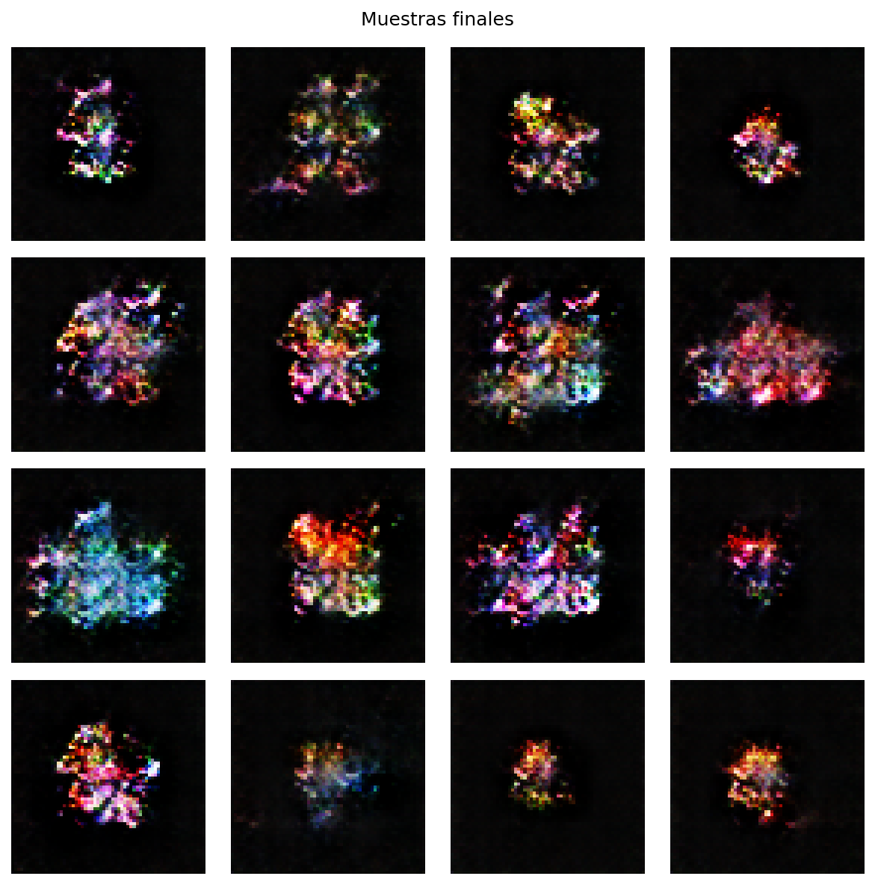
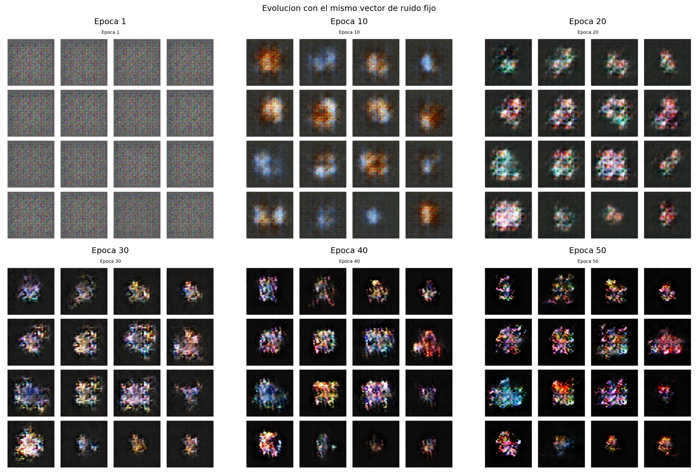
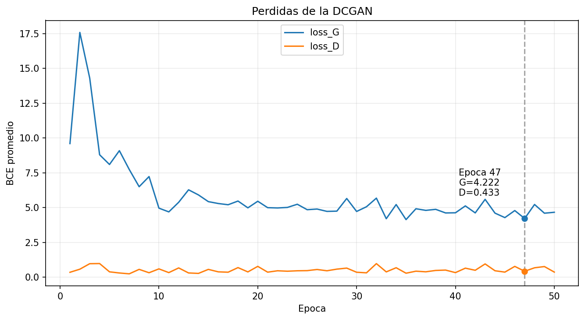

# Hoja de Trabajo 2 - DCGAN para sprites de Pokemon

**Curso:** CC3092 - Deep Learning  
**Integrantes:** Vianka Castro - Ricardo Godínez  

# Task 1 

## Task 1.1 - Generador y discriminador

### Parametros fijos

```python
Z_DIM = 100
IMG_SIZE = 64
IMG_CHANNELS = 3
FEATURES_G = 64
FEATURES_D = 64
```

### Generador

El generador recibe un vector de ruido
\(z \in \mathbb{R}^{100}\) con forma `(batch, 100, 1, 1)` y produce una imagen
con forma `(batch, 3, 64, 64)`.

| Capa | Canales | Salida espacial | Normalizacion | Activacion |
|---|---:|---:|---|---|
| ConvTranspose2d 1 | 100 -> 512 | 4x4 | BatchNorm2d | ReLU |
| ConvTranspose2d 2 | 512 -> 256 | 8x8 | BatchNorm2d | ReLU |
| ConvTranspose2d 3 | 256 -> 128 | 16x16 | BatchNorm2d | ReLU |
| ConvTranspose2d 4 | 128 -> 64 | 32x32 | BatchNorm2d | ReLU |
| ConvTranspose2d 5 | 64 -> 3 | 64x64 | Ninguna | Tanh |

La salida `Tanh` se encuentra en `[-1, 1]`, el mismo rango usado para
normalizar las imagenes reales.

### Discriminador

El discriminador recibe `(batch, 3, 64, 64)` y entrega una probabilidad por
imagen con forma `(batch,)`.

| Capa | Canales | Salida espacial | Normalizacion | Activacion |
|---|---:|---:|---|---|
| Conv2d 1 | 3 -> 64 | 32x32 | Ninguna | LeakyReLU(0.2) |
| Conv2d 2 | 64 -> 128 | 16x16 | BatchNorm2d | LeakyReLU(0.2) |
| Conv2d 3 | 128 -> 256 | 8x8 | BatchNorm2d | LeakyReLU(0.2) |
| Conv2d 4 | 256 -> 512 | 4x4 | BatchNorm2d | LeakyReLU(0.2) |
| Conv2d 5 | 512 -> 1 | 1x1 | Ninguna | Sigmoid |

La ultima salida se aplana con `.view(-1)` para obtener un escalar por imagen.

### Pruebas de forma

```python
z = torch.randn(4, Z_DIM, 1, 1)
assert generator(z).shape == (4, 3, 64, 64)

x = torch.randn(4, 3, 64, 64)
assert discriminator(x).shape == (4,)
```

**Resultado verificado:** ambas pruebas pasan. El generador tiene 3,576,704
parametros y el discriminador 2,765,568 parametros.

## Task 1.2 - Entrenamiento alternado

### Funcion de perdida y optimizadores

Se utiliza `BCELoss` y Adam para ambos modelos:

| Hiperparametro | Valor |
|---|---:|
| `batch_size` | 32 |
| `epochs` | 50 |
| `lr` | 0.0002 |
| `betas` | `(0.5, 0.999)` |
| Funcion de perdida | `BCELoss` |

Para cada batch, la perdida del discriminador es:

\[
\mathcal{L}_D =
\operatorname{BCE}(D(x), 1) +
\operatorname{BCE}(D(G(z)\operatorname{.detach}()), 0).
\]

`detach()` impide que el paso de D propague gradientes hacia el generador.

Para actualizar el generador se crea un vector de ruido nuevo y se utiliza el
objetivo no saturante:

\[
\mathcal{L}_G = \operatorname{BCE}(D(G(z')), 1).
\]

Esto corresponde a entrenar G para que D clasifique sus muestras como reales.

### Artefactos registrados

En cada epoca se guardan:

- Promedio de `loss_G`.
- Promedio de `loss_D`.
- Grilla de 16 imagenes generadas con el mismo `fixed_noise`.

El historial se guarda en `outputs/task1/history.csv` y las grillas en
`outputs/task1/grids/`.

### Estado y resultados

- [x] Forward del generador y discriminador.
- [x] Backward y actualizacion de ambos optimizadores.
- [x] Smoke test de una epoca con datos sinteticos.
- [x] Lectura de un batch real `(32, 3, 64, 64)`.
- [x] Entrenamiento completo de 50 epocas.
- [x] Revision de las 50 grillas.

| Resultado | Valor observado |
|---|---|
| Tiempo total de entrenamiento | 2,564.13 s (42 min 44 s), CPU |
| `loss_G` inicial / final | 9.6023 / 4.6684 |
| `loss_D` inicial / final | 0.3592 / 0.3728 |
| Promedio de `loss_G` en las ultimas 10 epocas | 4.7752 |
| Promedio de `loss_D` en las ultimas 10 epocas | 0.6000 |
| Epoca con perdidas mas cercanas | 47: G=4.2218, D=0.4328 |
| Diferencia minima entre perdidas | 3.7890 |
| Observacion principal | Mejora visual sin convergencia adversarial completa |

### Analisis del entrenamiento

El discriminador aprendio con mucha mayor rapidez al inicio. En la primera
epoca se obtuvo `loss_D=0.3592` y `loss_G=9.6023`; en la segunda epoca la
perdida del generador alcanzo su maximo, 17.5842. Esto indica que D separaba con
facilidad las muestras reales de las generadas y proporcionaba una senal
adversarial exigente para G. A partir de aproximadamente la epoca 10,
`loss_G` descendio al rango 4-6 y permanecio oscilando dentro de ese intervalo,
mientras `loss_D` se mantuvo generalmente por debajo de 1.0.

Las curvas no son monotonas. Por ejemplo, `loss_D` subio de 0.3208 en la epoca
31 a 0.9813 en la 32 y luego bajo a 0.3873 en la 33. Esta dinamica es coherente
con un juego adversarial: una mejora temporal de un modelo altera el problema
que enfrenta el otro. La epoca 47 minimizo la diferencia absoluta entre las dos
perdidas, pero la diferencia todavia fue 3.7890. Por lo tanto, el punto anotado
cumple el criterio solicitado, pero no debe interpretarse como un equilibrio o
una convergencia perfecta.

Visualmente, las primeras grillas contienen ruido cuadriculado. Para las epocas
10 y 20 aparecen masas de color compactas y, hacia las epocas 30-50, se observan
siluetas con distintas escalas, orientaciones, paletas y posibles apendices. La
mejora visual es clara aunque las imagenes siguen siendo ambiguas y no siempre
se reconocen como un Pokemon concreto.

## Task 1.3 - Visualizaciones

### Grilla final 4x4

**Archivo esperado:** `outputs/task1/final_grid.png`



Las 16 muestras finales presentan diversidad de tamano, color y forma. Algunas
son alargadas, otras compactas y varias sugieren extremidades, alas o cabezas.
No se observa que las 16 imagenes sean copias de una sola salida, por lo que no
hay evidencia visual de colapso de modo total en el entrenamiento base. Sin
embargo, persisten texturas de tablero asociadas a las capas
`ConvTranspose2d`, contornos poco definidos y estructuras que no alcanzan una
identidad semantica clara.

### Evolucion con ruido fijo



El uso del mismo `fixed_noise` permite seguir cada muestra a traves del tiempo.
La evolucion pasa de ruido estructurado en la epoca 1 a blobs centrales en la
10, formas multicolor en la 20 y siluetas mas compactas entre las epocas 30 y
50. La mayor mejora ocurre en la primera mitad; despues, los cambios son
principalmente refinamientos de color y borde.

### Curvas de `loss_G` y `loss_D`

**Archivo esperado:** `outputs/task1/losses.png`



La figura debe mostrar ambas perdidas durante las 50 epocas y anotar el punto:

\[
e^* = \arg\min_e |\operatorname{loss}_G(e)-\operatorname{loss}_D(e)|.
\]

**Epoca anotada:** 47 (`loss_G=4.2218`, `loss_D=0.4328`).
**Interpretacion:** fue la menor separacion observada, no un cruce de las
curvas. D mantuvo una perdida considerablemente menor que G durante todo el
entrenamiento, lo que sugiere que el discriminador conservo ventaja.

### Conclusiones de Task 1

1. **Calidad final:** las salidas poseen color y siluetas tipo sprite, pero son
   borrosas y solo parcialmente reconocibles.
2. **Diversidad:** existen diferencias visibles de forma, escala y paleta; no
   se observa colapso total en las 16 muestras finales.
3. **Estabilidad del entrenamiento:** no hubo NaN ni divergencia numerica. Las
   perdidas oscilaron, como es esperable en una GAN, y se estabilizaron en un
   rango durante la segunda mitad.
4. **Limitaciones observadas:** D permanecio mas fuerte que G, las perdidas no
   se acercaron realmente y las convoluciones transpuestas produjeron patrones
   de tablero. Cincuenta epocas y un dataset de 898 imagenes fueron suficientes
   para aprender estructura global, pero no detalle semantico fino.

---

# Task 2 - Entrega final

## Task 2.1 - Colapso de modo inducido

### Configuracion experimental

Reutilizar la arquitectura y el dataset de Task 1, pero entrenar durante 20
epocas con cinco pasos del discriminador por cada paso del generador.

| Parametro | Valor |
|---|---:|
| Epocas | 20 |
| Pasos de D por iteracion | 5 |
| Pasos de G por iteracion | 1 |
| Ruido fijo | 16 vectores |
| Salida esperada | Grilla 4x4 de baja diversidad |

**Notebook previsto:** `notebooks/task2.ipynb`  
**Grilla prevista:** `outputs/task2/collapse_grid.png`

### Evidencia experimental

| Metrica | Entrenamiento base | Colapso inducido |
|---|---:|---:|
| `loss_G` final | _[Pendiente]_ | _[Pendiente]_ |
| `loss_D` final | _[Pendiente]_ | _[Pendiente]_ |
| Media de `D(G(z))` | _[Pendiente]_ | _[Pendiente]_ |
| Norma del gradiente de G | _[Pendiente]_ | _[Pendiente]_ |
| Diversidad entre muestras | _[Pendiente]_ | _[Pendiente]_ |

_[Insertar la grilla y describir concretamente que elementos se repiten y por
que la evidencia muestra baja diversidad.]_

### Pregunta a)

**Explique matematicamente por que entrenar D muchas mas veces que G induce el
modo colapso. Incluya que le sucede al gradiente
\(\nabla_{\theta_G}\mathcal{L}_G\) cuando \(D(G(z)) \approx 0\) para todas las
muestras y por que el generador no puede recuperarse de ese estado.**

**Respuesta:**  
_[Pendiente. Incluir la regla de la cadena, los valores de gradiente observados
y distinguir el objetivo minimax del objetivo no saturante implementado.]_

### Pregunta b)

**En el modo colapso observado, que valor toma aproximadamente \(D^*(x)\) para
las imagenes que el generador produce repetidamente? Justifique desde la formula
del discriminador optimo derivada en clase.**

Usar como punto de partida:

\[
D^*(x)=\frac{p_{data}(x)}{p_{data}(x)+p_G(x)}.
\]

**Respuesta:**  
_[Pendiente. Sustituir el comportamiento relativo de las dos densidades en la
region repetida por G.]_

### Pregunta c)

**Proponga una modificacion concreta al loop de entrenamiento, distinta de
cambiar la proporcion de pasos, que pueda prevenir el modo colapso. Justifique
por que funcionaria en terminos del gradiente.**

**Modificacion propuesta:** _[Pendiente]_  
**Justificacion matematica:** _[Pendiente]_  
**Como se incorporaria al loop:** _[Pendiente]_

## Task 2.2 - Estimacion empirica de Jensen-Shannon

Usando el discriminador y los registros del entrenamiento base de Task 1,
estimar JSD en distintos momentos de las 50 epocas.

La relacion teorica es:

\[
V(D^*,G)=-\log 4+2\,\operatorname{JSD}(p_{data}\parallel p_G).
\]

Por lo tanto:

\[
\widehat{\operatorname{JSD}}=
\frac{\widehat{V}(D,G)+\log 4}{2}.
\]

Para evitar ambiguedad, registrar directamente:

\[
\widehat{V}(D,G)=
\mathbb{E}[\log D(x)]+\mathbb{E}[\log(1-D(G(z)))].
\]

### Curva JSD

**Archivo esperado:** `outputs/task2/jsd_curve.png`

| Momento | Epoca | JSD estimada |
|---|---:|---:|
| Inicio | _[Pendiente]_ | _[Pendiente]_ |
| Mitad | _[Pendiente]_ | _[Pendiente]_ |
| Final | _[Pendiente]_ | _[Pendiente]_ |

_[Insertar la curva y describir su tendencia, oscilaciones y posibles valores
fuera del intervalo teorico producidos por la aproximacion.]_

### Pregunta a)

**El estimado supone que el discriminador entrenado es el discriminador optimo
\(D^*\) para el generador actual. En la practica esto no ocurre durante el
entrenamiento alternado. En que direccion sesga este supuesto el estimado: lo
sobreestima o lo subestima? Por que?**

**Respuesta:**  
_[Pendiente. Comparar \(V(D,G)\) con el maximo \(V(D^*,G)\).]_

### Pregunta b)

**Hacia el final del entrenamiento, si la GAN converge bien, hacia que valor
deberia tender JSD? La curva empirica es consistente con ese valor teorico?**

**Valor teorico:** _[Pendiente]_  
**Valor final observado:** _[Pendiente]_  
**Conclusion:** _[Pendiente]_

### Conclusiones de Task 2

1. **Evidencia de colapso:** _[Pendiente]_
2. **Comportamiento del gradiente:** _[Pendiente]_
3. **Evolucion de JSD:** _[Pendiente]_
4. **Diferencia entre teoria y estimacion empirica:** _[Pendiente]_

---

# Task 3 - Investigacion

## Seleccion del paper

Seleccionar exactamente una opcion:

- [ ] **Opcion A:** gradiente que desaparece cuando D es demasiado bueno.
  Paper objetivo: WGAN, Arjovsky et al. (2017).
- [ ] **Opcion B:** inestabilidad y dificultad de evaluar imagenes generadas.
  Paper objetivo: Inception Score o FID, Heusel et al. (2017).
- [ ] **Opcion C:** colapso de modo y falta de diversidad.
  Paper objetivo: Unrolled GANs, Metz et al. (2017), o MinibatchGAN.

**Paper seleccionado:** _[Pendiente]_  
**Autores y ano:** _[Pendiente]_  
**Venue:** _[NeurIPS / ICML / ICLR / CVPR]_  
**Enlace o DOI:** _[Pendiente]_  
**Razon de la seleccion:** _[Pendiente]_

La seccion final debe tener entre **400 y 600 palabras**, sin contar referencias.

## Pregunta a) - Problema y formulacion matematica

**Que problema especifico de las GANs originales identifica el paper y como lo
formaliza matematicamente? No basta con nombrar el problema; debe explicarse la
formulacion tal como aparece en el paper.**

**Respuesta:**  
_[Pendiente. Definir variables, distribuciones y ecuaciones antes de interpretar
su significado.]_

## Pregunta b) - Modificacion propuesta

**Que modificacion propone el paper respecto a la funcion de valor \(V(D,G)\) o
al procedimiento de entrenamiento? Escriba la nueva funcion objetivo si el
paper la propone.**

**Respuesta:**  
_[Pendiente. Comparar explicitamente el metodo original y el metodo propuesto.]_

## Pregunta c) - Conexion con Task 2

**Conecte explicitamente la solucion del paper con algo observado
experimentalmente en Task 2. La conexion debe usar valores concretos de
perdida, gradiente, salida de D, JSD o diversidad y explicar como el paper los
habria modificado.**

**Evidencia de Task 2 utilizada:** _[Pendiente]_  
**Conexion con el paper:** _[Pendiente]_

## Seccion de investigacion final - 400 a 600 palabras

_[Redactar aqui una respuesta integrada que cubra a), b) y c).]_

**Conteo de palabras:** _[Pendiente]_

## Referencias

1. Radford, A., Metz, L. y Chintala, S. (2015). _Unsupervised Representation
   Learning with Deep Convolutional Generative Adversarial Networks_.
2. _[Agregar el paper seleccionado con referencia completa.]_
3. _[Agregar cualquier fuente primaria adicional utilizada.]_

---

# Registro de uso de IA generativa

La consigna solicita registrar los prompts utilizados, el task correspondiente
y explicar por que fueron utiles. No incluir respuestas sin verificarlas contra
el codigo, los datos, las diapositivas o los papers originales.

| Task | Prompt utilizado | Proposito | Por que funciono | Como se verifico |
|---|---|---|---|---|
| Planificacion | _[Completar]_ | Organizar el trabajo | _[Completar]_ | PDF y repo |
| Task 1 | _[Completar]_ | _[Completar]_ | _[Completar]_ | Pruebas y resultados |
| Task 2 | _[Completar]_ | _[Completar]_ | _[Completar]_ | Formulas y experimento |
| Task 3 | _[Completar]_ | _[Completar]_ | _[Completar]_ | Paper original |

# Lista de verificacion de entrega

- [ ] Task 1 contiene arquitectura, entrenamiento, grilla y curvas.
- [ ] Task 2 contiene colapso, respuestas matematicas y curva JSD.
- [ ] Task 3 tiene entre 400 y 600 palabras y cita un venue permitido.
- [ ] Todas las cifras del reporte existen y tienen etiquetas legibles.
- [ ] Las conclusiones usan resultados observados, no valores inventados.
- [ ] Los prompts de IA estan documentados y verificados.
- [ ] El codigo comenta la relacion con las formulas de clase.
- [ ] El PDF final contiene los tres tasks.
- [ ] Se adjunta el `.ipynb` o enlace al repositorio de GitHub.
